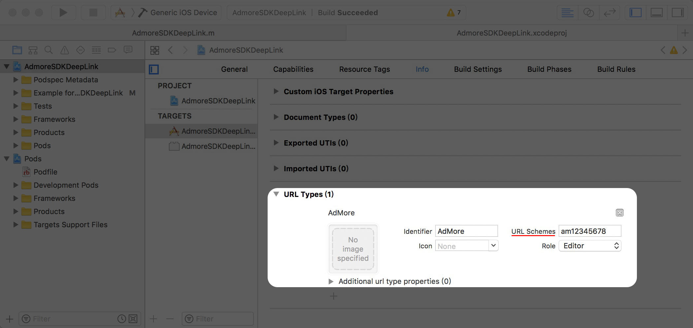
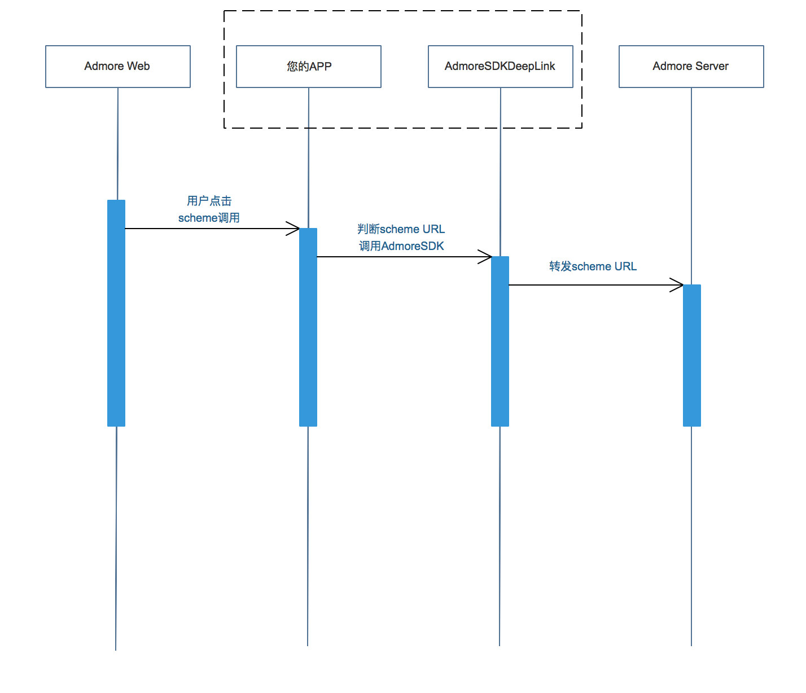
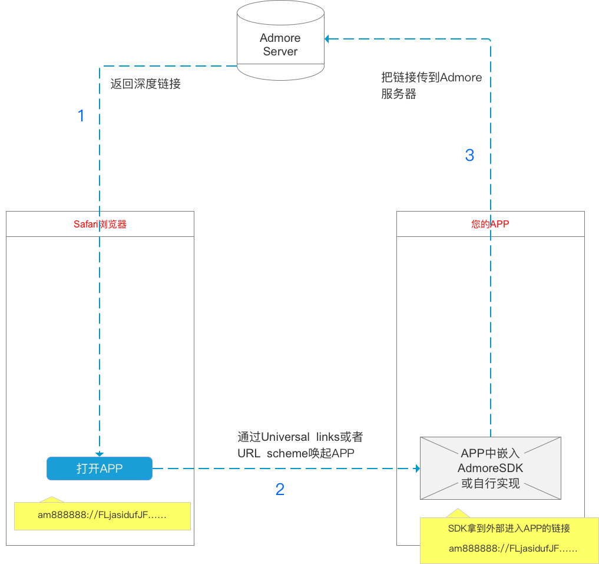

# 接入方案选择
1. 使用webview拉起“多点广告落地页”
> 接入方式：注册scheme, 然后取其中url参数拉起webview即可; 
> 
> 可参考https://github.com/duodiankeji/deeplinklib.git 里方案一代码，客户可使用自己原有的webview;
> 
> 只要提供一个可拉起webview的scheme入口即可，无需集成sdk。

2. 使用”多点广告 DeepLink 接口“发送数据给多点广告
> 优点：数据进行加密发送防刷防泄漏，不改变原产品启动流程；
> 
> 接入方法详见以下文档

*** 

# 多点广告 DeepLink 接口

## DeepLink
DeepLink，又叫deep linking，中文翻译作深层链接。

1. 简单地从用户体验来讲，DeepLink 就是可以在手机的浏览器上(Safari/Chorme)点击，便能直接跳转到已安装的应用中的某一个页面的技术。
2. 乍一看，Deep Link不就是scheme么？不错，或者我们该说，目前iOS APP的 scheme，就是DeepLink的一种雏形（仅仅是跳转）。
3. 我们需要您判断，如果是通过我们预先生成的scheme拉起应用，便向多点广告服务器发送一次数据请求，让我们知道您的APP已经联网打开。

## QA：
1. 是否APP的所有数据都会发到多点广告？

 >只有通过多点广告投放的用户，会通过预先设定的scheme拉起应用，才会请求多点广告服务器。即仅对广告效果进行追踪。

2. 是否可以不用SDK

 >我们提供SDK只是针对传到多点广告的数据进行处理。我们的SDK是开源的，当然您也可以直接自己按照我们的要求处理下数据。

3. IDFA

 >SDK中使用了IDFA，请在提交AppStore时请选择使用效果追踪。如果您之前项目中已使用IDFA请忽略该项。
 
## 安装
将 AdmoreSDKDeepLink.h 和 AdmoreSDKDeepLink.m放入工程。

也可以直接pod命令安装

```ruby
pod 'AdmoreSDKDeepLink', :git => 'https://github.com/duodiankeji/deeplink.git'
```

## 使用


按照以下简单的步骤，在5分钟内为您的应用添加deep link支持。

**1. 在您的APP项目中，Info.plist 添加URL scheme**



<br />
**2. 引用 AdmoreSDKDeepLink.h**

```objc
#import <AdmoreSDKDeepLink/AdmoreSDKDeepLink.h>
```
<br />

**3. 在 `application:didFinishLaunchingWithOptions:`中初始化**

```objc
- (BOOL)application:(UIApplication *)application didFinishLaunchingWithOptions:(NSDictionary *)launchOptions
{
    [AdmoreSDKDeepLink setAppId:@"appId" appKey:@"appkey"];
    ...
}
```

 >AppID：APP在多点广告的唯一ID
 
 >AppKey：多点广告分配

**4.在您的 AppDelegate 中 override`application:openURL:options:`方法，调用AdmoreSDK的`handleUrl:withAppId:`:**

```objc
- (BOOL) application:(UIApplication *)app openURL:(NSURL *)url options:(NSDictionary<UIApplicationOpenURLOptionsKey,id> *)options {

    if( [AdmoreSDKDeepLink handleUrl:url] ) {
        return YES;
    }
    //处理您的其他逻辑
    return NO;

    //或者直接 return [AdmoreSDKDeepLink handleUrl:url];
}

```
如果您的APP只支持iOS9(含)以上版本，只需添加以上函数即可。如果需要支持iOS9以下，则`application:handleOpenURL:`也需要处理

```objc
- (BOOL)application:(UIApplication *)application handleOpenURL:(NSURL *)url {

    if( [AdmoreSDKDeepLink handleUrl:url] ) {
        return YES;
    }
    //处理您的其他逻辑
    return NO;

    //或者直接 return [AdmoreSDKDeepLink handleUrl:url];
}
```

<br />
##时序图


##业务图

